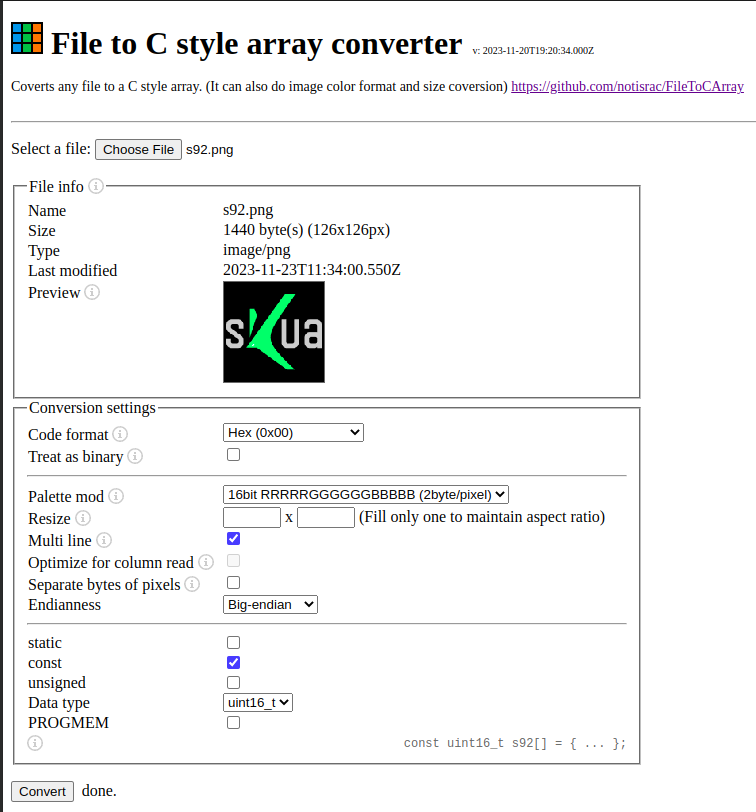

# Nucleo-WB55RG-LCD

SPI1_MCLK PA5
SPI1_MISO PA6
SPI1_MOSI PA7
DC PA9
CS PA4
RST PC12

- https://github.com/Floyd-Fish/ST7789-STM32
- https://github.com/ScarsFun/STM32F4_ST7789_LL_DMA
- https://github.com/zst-embedded/STM32-LCD_Font_Generator
- https://notisrac.github.io/FileToCArray/
- https://notisrac.github.io/FileToCArray/
